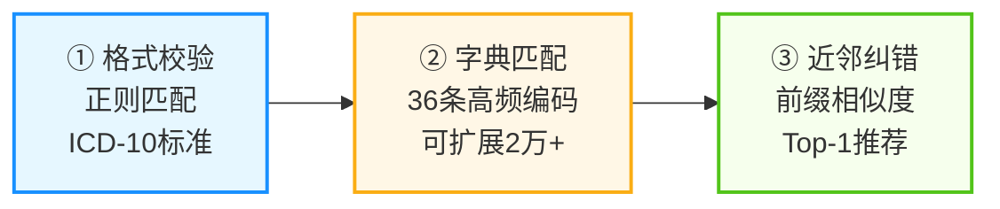
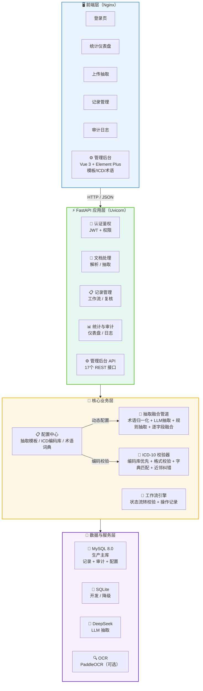
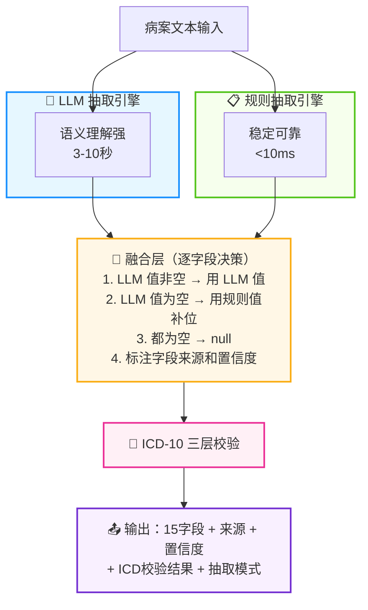
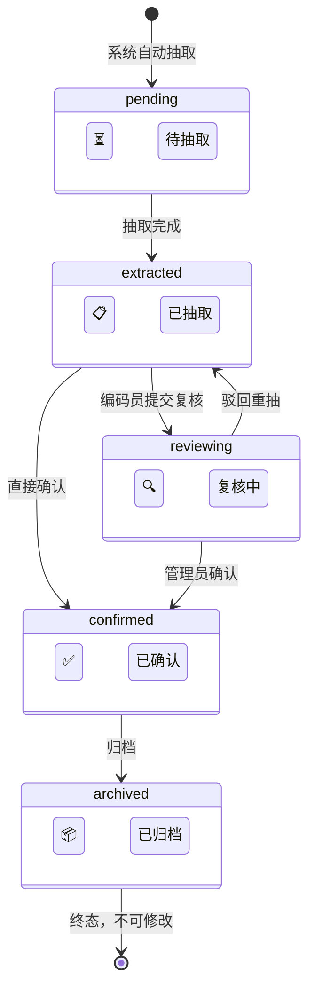

<div align="center">

# 🏥 医疗病案智能编码系统

**Medical Record Intelligent Coding System**

基于 LLM + 规则双引擎的医疗病案结构化抽取与全流程编码管理平台

[](https://www.python.org/)
[](https://fastapi.tiangolo.com/)
[](https://www.mysql.com/)
[](https://www.docker.com/)
[](LICENSE)
[](https://www.deepseek.com/)

</div>

---

## 📑 目录

<details>
<summary><strong>点击展开/收起目录</strong></summary>

- [✨ 核心技术亮点](#-核心技术亮点)
- [🏗️ 系统架构](#️-系统架构)
- [🔧 核心模块详解](#-核心模块详解)
- [📦 技术栈选型](#-技术栈选型)
- [🗄️ 数据库设计](#️-数据库设计)
- [🌐 API 接口设计](#-api-接口设计)
- [📊 性能指标](#-性能指标)
- [🚀 快速开始](#-快速开始)
- [⚙️ 管理后台](#️-管理后台)
- [📁 项目结构](#-项目结构)
- [🔮 后续演进方向](#-后续演进方向)
- [📄 License](#-license)

</details>

---

## ✨ 核心技术亮点

### 1️⃣ LLM + 规则双引擎融合抽取

| 引擎 | 特点 | 性能 |
|---|---|---|
| 🤖 **LLM 引擎** | DeepSeek Chat 语义理解，灵活适应不同医院格式 | 3-10s/份 |
| 📋 **规则引擎** | 正则+关键词，稳定快速零成本，离线可用 | <10ms/份 |
| 🔀 **融合策略** | LLM 值非空优先，规则值补空缺，标注来源和置信度 | 综合准确率 ~92.8% |

> **技术难点**：解决 LLM 不稳定、幻觉问题，同时保留规则引擎的确定性，融合后兼顾准确率与召回率。

### 2️⃣ ICD-10 三层校验闭环



> **技术难点**：ICD 编码是医保结算核心数据，错误编码会导致医保拒付，三层校验将编码错误率降至最低。

### 3️⃣ 工作流状态机 + 人工复核闭环


- ✅ 5 状态闭环，状态流转严格校验，非法流转自动拒绝
- ✅ 字段级人工修正，标记为「人工修正」，置信度置为 1.0
- ✅ 每个状态记录操作人、操作时间，全程可追溯

### 4️⃣ 全链路审计日志

- 📝 操作留痕：登录、创建记录、提交复核、确认归档、驳回、归档、批量处理
- 👤 记录维度：操作人、科室、时间、IP、操作详情（修改字段、新旧值对比）
- 🔒 权限隔离：管理员可见全部日志，普通用户仅见自己的操作

> **合规价值**：医疗数据合规要求操作可追溯，审计日志满足等保三级要求。

### 5️⃣ 科室级权限隔离

| 角色 | 科室 | 权限 |
|---|---|---|
| 👨‍⚕️ **编码员** | 病案科 | 可抽取 + 可复核本科记录 |
| 👨‍💼 **管理员** | 医务部 | 全量可见 + 全部操作 |
| 👁️ **查看员** | 医保办/临床科室 | 仅查看，不可修改 |

- 🔐 JWT Token 认证，支持过期时间配置
- 🚫 普通用户仅可见本科室记录，管理员可见全部

### 6️⃣ 可视化管理后台（Vue 3 + Element Plus）

| 管理模块 | 功能 | 抽取流程集成 |
|---|---|---|
| 📋 **抽取模板管理** | 不同类型病案的抽取字段动态配置（增删改查） | ✅ 按模板字段抽取，替代默认15字段 |
| 🏥 **ICD编码库管理** | 疾病编码与名称维护，分类筛选、搜索、启停 | ✅ ICD校验优先查编码库 |
| 📝 **术语词典管理** | 同义词/缩写/别名/口语化术语映射 | ✅ 抽取前自动术语归一化 |
| 📊 **统计仪表盘** | 各模块数据统计 + 快速入口 | - |

> **技术价值**：将原本硬编码的抽取字段、ICD字典、术语映射全部可视化配置，业务人员无需改代码即可维护系统，大幅提升可维护性和可扩展性。

---

## 🏗️ 系统架构



---

## 🔧 核心模块详解

### 🔀 双引擎抽取管道 (`app/extractor/pipeline.py`)



**融合策略核心代码：**

```python
def _merge(llm_fields, rule_fields):
    for key in FIELD_KEYS:
        llm_v = llm_fields.get(key, "")
        rule_v = rule_fields.get(key, {}).get("value", "")
        if llm_v:
            # LLM 抽取到非空值，优先使用
            merged[key] = FieldResult(key, label, llm_v, 0.9, "llm")
        elif rule_v:
            # LLM 没抽到，用规则补位
            merged[key] = FieldResult(key, label, rule_v, 0.7, "rule")
        else:
            merged[key] = FieldResult(key, label, "", 0.0, "none")
```

### 🏥 ICD-10 校验器 (`app/icd/icd_validator.py`)

**三层校验流程：**

1. **归一化**：去空格、转大写、全角转半角
2. **格式校验**：正则 `^[A-Z]\d{2}(\.\d{1,2})?$`
3. **字典匹配**：在 `icd_sample.json` 中查询编码是否存在
4. **近邻纠错**：未命中时按前缀相似度排序，推荐 Top-1 最接近编码

**校验结果示例：**

```json
{
  "code": "I10",
  "valid_format": true,
  "in_dictionary": true,
  "name": "原发性高血压",
  "suggestion": "编码有效",
  "matched": true
}
```

### 🔄 工作流状态机 (`app/db.py` + `app/main.py`)



**状态流转规则：**

| 当前状态 | 允许流转到 | 操作 |
|---|---|---|
| ⏳ 待抽取 (pending) | 已抽取 | 系统自动抽取 |
| 📋 已抽取 (extracted) | 复核中 / 已确认 | 编码员提交复核 / 直接确认 |
| 🔍 复核中 (reviewing) | 已确认 / 已抽取 | 管理员确认 / 驳回重抽 |
| ✅ 已确认 (confirmed) | 已归档 | 归档 |
| 📦 已归档 (archived) | — | 终态，不可修改 |

**非法流转自动拒绝：**

```python
allowed = STATUS_TRANSITIONS.get(current_status, [])
if new_status not in allowed:
    raise HTTPException(400, f"状态流转不合法：{current_status} → {new_status}")
```

### ⚙️ 可视化管理后台 (`app/admin_db.py` + `app/admin_api.py` + `admin/`)

将原本硬编码的抽取配置全部可视化、可配置化，业务人员无需改代码即可维护系统。

#### 三大管理模块

| 模块 | 数据库表 | 核心功能 | 抽取流程集成点 |
|---|---|---|---|
| 📋 **抽取模板** | `extraction_templates` | 按文档类型配置抽取字段（动态字段编辑器） | `extract_fields(template_name=...)` |
| 🏥 **ICD编码库** | `icd_codes` | 疾病编码维护、分类、搜索、启停 | `validate_icd()` 优先查库 |
| 📝 **术语词典** | `term_dictionary` | 同义词/缩写/别名/口语化映射 | `_normalize_terms()` 抽取前归一化 |

#### 抽取流程集成架构


#### 术语归一化核心代码

```python
def _normalize_terms(text: str) -> str:
    """术语归一化：用术语词典中的标准术语替换非标准表述。"""
    mappings = get_all_term_mappings()  # 从数据库加载所有启用的术语映射
    result = text
    for term, standard in mappings.items():
        if term in result:
            result = result.replace(term, standard)
    return result
```

#### ICD 校验优先查库

```python
def validate_icd(code: str) -> dict:
    # 1. 优先查询数据库 ICD 编码库
    db_item = _query_db(code)
    if db_item:
        return {"code": code, "in_dictionary": True,
                "name": db_item["name"], "suggestion": "编码有效（来自编码库）"}
    # 2. 回退到内置示例字典
    # 3. 近邻纠错建议
```

---

## 📦 技术栈选型

| 分类 | 技术选型 | 选型原因 |
|---|---|---|
| 🚀 后端框架 | **FastAPI** | 异步高性能、自动生成 OpenAPI 文档、Pydantic 类型校验、开发效率高 |
| 📊 数据模型 | **Pydantic v2** | 类型安全、请求/响应自动校验、序列化性能好 |
| 🤖 大模型 | **DeepSeek Chat** | OpenAI 兼容接口、中文理解好、性价比高、支持 function calling |
| 💾 数据库 | **MySQL 8.0 + SQLite** | 生产用 MySQL（稳定、JSON 字段支持），开发/降级用 SQLite（零配置） |
| 🔐 认证 | **PyJWT** | 轻量级 JWT 实现、无状态、易扩展 |
| 📄 文档解析 | **PyMuPDF + python-docx + openpyxl + python-pptx** | 覆盖主流办公格式、纯 Python 无系统依赖 |
| 🔍 OCR | **PaddleOCR（可选）** | 中文识别准确率高、开源免费、可开关 |
| 🎨 前端 | **原生 HTML + CSS + JS + ECharts** | 零构建、易部署、单页应用、ECharts 图表能力强 |
| ⚙️ 管理后台 | **Vue 3 + Element Plus + Vite** | 组件化开发、Element Plus 企业级组件、Vite 极速构建、适合复杂表单和CRUD管理 |
| 🌐 反向代理 | **Nginx** | 静态资源服务 + API 反向代理、负载均衡、生产级稳定 |
| 🐳 部署 | **Docker + Docker Compose** | 环境一致性、一键部署、易扩展、容器隔离 |
| 🧪 测试 | **pytest** | 生态成熟、插件丰富、fixtures 机制好 |

<details>
<summary><strong>❓ 为什么不用 LangChain / LangGraph？</strong></summary>

- 本项目抽取逻辑相对固定，不需要复杂的 Agent 编排
- 自研融合管道更轻量、可控、易调试，避免框架黑盒
- 减少依赖，降低部署复杂度和版本兼容风险

</details>

<details>
<summary><strong>❓ 为什么业务前端用原生 JS，管理后台用 Vue 3？</strong></summary>

- **业务前端**（登录/仪表盘/上传/列表/复核）：以展示和简单表单为主，原生 JS 零构建直接部署，减少工程化复杂度
- **管理后台**（模板/ICD/术语的CRUD管理）：包含动态字段编辑器、复杂表单、分页表格等交互，Vue 3 + Element Plus 组件化开发效率更高，维护性更好
- 两者通过 Nginx 统一部署，互不影响

</details>

---

## 🗄️ 数据库设计

### extraction_records（抽取记录表）

| 字段 | 类型 | 说明 |
|---|---|---|
| `id` | BIGINT | 主键 |
| `doc_name` | VARCHAR(255) | 文档名称 |
| `department` | VARCHAR(64) | 科室归属 |
| `fields_json` | JSON | 15 字段抽取结果（含来源和置信度） |
| `icd_json` | JSON | ICD 校验结果 |
| `original_text` | TEXT | 原始病案文本（复核时参考） |
| `mode` | VARCHAR(32) | 抽取模式（llm+rule / rule） |
| `confidence` | FLOAT | 平均置信度 |
| `status` | VARCHAR(16) | 工作流状态 |
| `reviewer` | VARCHAR(64) | 复核人 |
| `reviewed_at` | DATETIME | 复核时间 |
| `confirmed_by` | VARCHAR(64) | 确认人 |
| `confirmed_at` | DATETIME | 确认时间 |
| `created_at` | DATETIME | 创建时间 |
| `updated_at` | DATETIME | 更新时间 |

### audit_logs（审计日志表）

| 字段 | 类型 | 说明 |
|---|---|---|
| `id` | BIGINT | 主键 |
| `username` | VARCHAR(64) | 操作人 |
| `department` | VARCHAR(64) | 操作人科室 |
| `action` | VARCHAR(32) | 操作类型 |
| `target_type` | VARCHAR(32) | 目标类型 |
| `target_id` | VARCHAR(64) | 目标ID |
| `detail` | JSON | 操作详情（修改字段、新旧值） |
| `ip_address` | VARCHAR(64) | 操作IP |
| `created_at` | DATETIME | 操作时间 |

### extraction_templates（抽取模板表）

| 字段 | 类型 | 说明 |
|---|---|---|
| `id` | BIGINT | 主键 |
| `name` | VARCHAR(128) | 模板名称 |
| `doc_type` | VARCHAR(64) | 文档类型（入院记录/出院小结/手术记录等） |
| `description` | TEXT | 模板描述 |
| `fields_json` | JSON | 抽取字段配置（字段名/显示名/类型/必填/说明） |
| `is_active` | TINYINT | 是否启用（1启用/0停用） |
| `created_at` | DATETIME | 创建时间 |
| `updated_at` | DATETIME | 更新时间 |

### icd_codes（ICD编码库表）

| 字段 | 类型 | 说明 |
|---|---|---|
| `id` | BIGINT | 主键 |
| `code` | VARCHAR(32) | ICD编码（唯一） |
| `name` | VARCHAR(256) | 疾病名称 |
| `category` | VARCHAR(64) | 分类（呼吸系统/循环系统等） |
| `description` | TEXT | 编码说明 |
| `is_active` | TINYINT | 是否启用 |
| `created_at` | DATETIME | 创建时间 |
| `updated_at` | DATETIME | 更新时间 |

### term_dictionary（术语词典表）

| 字段 | 类型 | 说明 |
|---|---|---|
| `id` | BIGINT | 主键 |
| `term` | VARCHAR(128) | 术语/缩写/别名（唯一） |
| `standard_term` | VARCHAR(128) | 标准术语 |
| `term_type` | VARCHAR(32) | 类型（synonym同义词/abbreviation缩写/alias别名/colloquial口语化） |
| `description` | TEXT | 术语说明 |
| `is_active` | TINYINT | 是否启用 |
| `created_at` | DATETIME | 创建时间 |
| `updated_at` | DATETIME | 更新时间 |

---

## 🌐 API 接口设计

### 🔐 认证接口

| 方法 | 路径 | 说明 |
|---|---|---|
| `POST` | `/api/auth/login` | 登录获取 JWT Token |
| `GET` | `/api/auth/me` | 获取当前用户信息 |

### 📄 文档处理接口

| 方法 | 路径 | 说明 |
|---|---|---|
| `POST` | `/api/documents/parse` | 文档解析（上传文件，返回文本/表格/分片） |
| `POST` | `/api/documents/extract` | 文本抽取（传入文本，返回15字段+ICD） |
| `POST` | `/api/documents/process` | 一站式处理（解析+抽取+落库） |
| `POST` | `/api/documents/batch` | 批量处理（多文件上传，最多20个） |

### 📋 记录管理接口

| 方法 | 路径 | 说明 |
|---|---|---|
| `GET` | `/api/records` | 记录列表（状态筛选+分页，科室级可见性） |
| `GET` | `/api/records/{id}` | 记录详情（含原始文本、复核信息） |
| `POST` | `/api/records/{id}/review` | 人工复核（修改字段+状态流转） |

### 📊 统计与审计接口

| 方法 | 路径 | 说明 |
|---|---|---|
| `GET` | `/api/stats/overview` | 统计概览（总量/状态分布/ICD分布/趋势） |
| `GET` | `/api/audit-logs` | 审计日志列表（操作类型筛选） |

### ⚙️ 管理后台接口（17个）

| 模块 | 方法 | 路径 | 说明 |
|---|---|---|---|
| **抽取模板** | `GET` | `/api/admin/templates` | 模板列表（分页/搜索/类型筛选） |
| | `GET` | `/api/admin/templates/{id}` | 模板详情 |
| | `POST` | `/api/admin/templates` | 创建模板 |
| | `PUT` | `/api/admin/templates/{id}` | 更新模板 |
| | `DELETE` | `/api/admin/templates/{id}` | 删除模板 |
| **ICD编码库** | `GET` | `/api/admin/icd-codes` | 编码列表（分页/搜索/分类筛选） |
| | `GET` | `/api/admin/icd-codes/search?q=` | 编码搜索（模糊匹配） |
| | `GET` | `/api/admin/icd-codes/{id}` | 编码详情 |
| | `POST` | `/api/admin/icd-codes` | 新增编码 |
| | `PUT` | `/api/admin/icd-codes/{id}` | 更新编码 |
| | `DELETE` | `/api/admin/icd-codes/{id}` | 删除编码 |
| **术语词典** | `GET` | `/api/admin/terms` | 术语列表（分页/搜索/类型筛选） |
| | `GET` | `/api/admin/terms/{id}` | 术语详情 |
| | `POST` | `/api/admin/terms` | 新增术语 |
| | `PUT` | `/api/admin/terms/{id}` | 更新术语 |
| | `DELETE` | `/api/admin/terms/{id}` | 删除术语 |
| **统计** | `GET` | `/api/admin/stats` | 管理后台统计（各模块数量/启用数） |

### ⚙️ 系统接口

| 方法 | 路径 | 说明 |
|---|---|---|
| `GET` | `/healthz` | 健康检查 |
| `GET` | `/docs` | Swagger UI 在线文档 |
| `GET` | `/openapi.json` | OpenAPI 规范 |

---

## 📊 性能指标

| 指标 | 数值 | 测试环境 |
|---|---|---|
| ⏱️ 单份病案抽取（LLM+规则+ICD） | 3-10s | 含 DeepSeek API 调用 |
| ⚡ 规则抽取单独 | <10ms | 纯正则，离线可用 |
| 🏥 ICD 校验 | <5ms | 字典查询+前缀相似度 |
| 🎯 综合准确率 | ~92.8% | 12份样例评测 |
| ✅ ICD 匹配率 | ~91.7% | 12份样例评测 |
| 💯 完全正确率（15字段全对） | ~75% | 12份样例评测 |
| 🧪 测试通过率 | 100% | pytest 全部通过 |
| 💾 单容器内存占用 | ~500MB | Docker 容器 |

---

## 🚀 快速开始

### 📋 环境要求

- Python 3.10+
- MySQL 8.0（可选，不装自动降级 SQLite）
- Docker（可选，推荐用于生产部署）

### 💻 本地开发

```bash
# 1. 克隆项目
git clone <repo-url>
cd M9T-MedRecordAI

# 2. 创建虚拟环境
python -m venv .venv
# Windows
.venv\Scripts\activate
# Linux/Mac
source .venv/bin/activate

# 3. 安装依赖
pip install -r requirements.txt

# 4. 配置环境变量（可选，不填则用规则抽取模式）
cp .env.example .env
# 编辑 .env，填入 LLM_API_KEY

# 5. 生成样例数据
python data/gen_samples.py

# 6. 启动服务
uvicorn app.main:app --reload --port 8000
```

### 🌐 访问

| 页面 | 地址 |
|---|---|
| 🎨 业务前端页面 | http://localhost:8000 |
| ⚙️ 管理后台（Vue 3） | http://localhost:5174 |
| 📖 API 文档 | http://localhost:8000/docs |
| 💚 健康检查 | http://localhost:8000/healthz |

### ⚙️ 启动管理后台（可选）

```bash
# 新开终端，进入管理后台目录
cd admin

# 安装依赖
npm install

# 启动开发服务器（默认端口 5174，API 代理到 8000）
npm run dev
```

访问 http://localhost:5174 进入管理后台，可管理抽取模板、ICD编码库、术语词典。

### 👤 演示账号

> ⚠️ **注意**：以下为演示用默认账号，生产部署时务必修改或替换为院内统一认证（LDAP/SSO）

| 角色 | 用户名 | 密码 | 权限 |
|---|---|---|---|
| 👨‍⚕️ 编码员 | `binganke` | `bingan123` | 病案科，可抽取+复核 |
| 👨‍💼 管理员 | `yiwubu` | `yiwu123` | 医务部，全量权限 |
| 👁️ 查看员 | `yibaoban` | `yibao123` | 医保办，仅查看 |

### 🐳 Docker 部署

```bash
cd deploy

# 配置环境变量
cp .env.example .env
# 编辑 .env，填入 LLM_API_KEY、修改 JWT_SECRET

# 一键启动（App + MySQL + Nginx）
docker compose up -d --build

# 查看状态
docker compose ps

# 查看日志
docker compose logs -f app
```

访问：http://localhost（Nginx 反代，前端 + API 统一 80 端口）

---

## 📁 项目结构

```
M9T-MedRecordAI/
├── app/                          # 🎯 应用主目录
│   ├── main.py                   # FastAPI 主应用（33个 API 接口）
│   ├── config.py                 # ⚙️ 配置中心（环境变量统一读取）
│   ├── auth.py                   # 🔐 JWT 认证 + 科室级权限隔离
│   ├── db.py                     # 💾 数据持久化（MySQL/SQLite双后端 + 审计日志 + 统计）
│   ├── admin_db.py               # ⚙️ 管理后台数据库（3张配置表的CRUD）
│   ├── admin_api.py              # ⚙️ 管理后台 API（17个REST接口）
│   ├── schemas.py                # 📊 Pydantic 数据模型（请求/响应校验）
│   ├── llm_client.py             # 🤖 LLM 客户端封装（DeepSeek 兼容）
│   ├── chunker.py                # 📄 语义分片（标题/段落感知）
│   ├── extractor/                # 🔀 抽取引擎核心
│   │   ├── pipeline.py           # 融合管道（术语归一化+LLM+规则+ICD校验+模板字段）
│   │   ├── llm_extractor.py      # LLM 抽取引擎
│   │   ├── rule_extractor.py     # 规则抽取引擎（正则+关键词）
│   │   └── fields.py             # 15 类默认字段定义
│   ├── icd/                      # 🏥 ICD-10 校验模块
│   │   ├── icd_validator.py      # 三层校验器（编码库优先+格式+字典+纠错）
│   │   └── icd_sample.json       # 36 条高频编码字典（兜底用）
│   ├── eval/                     # 📈 评测体系
│   │   └── run_eval.py           # 逐字段比对 + 指标计算
│   └── parser/                   # 📄 文档解析器（7种格式）
│       ├── base.py               # 解析器基类 + 注册表
│       ├── pdf_parser.py         # PDF 解析
│       ├── docx_parser.py        # Word 解析
│       ├── xlsx_parser.py        # Excel 解析
│       ├── pptx_parser.py        # PPT 解析
│       ├── text_parser.py        # TXT/Markdown 解析
│       └── image_parser.py       # 图片 OCR 解析
├── admin/                        # ⚙️ 可视化管理后台（Vue 3 + Element Plus）
│   ├── src/
│   │   ├── views/
│   │   │   ├── Dashboard.vue     # 📊 仪表盘（统计卡片+快速入口）
│   │   │   ├── TemplateManage.vue # 📋 抽取模板管理（动态字段编辑器）
│   │   │   ├── IcdManage.vue     # 🏥 ICD编码库管理
│   │   │   └── TermManage.vue    # 📝 术语词典管理
│   │   ├── api/index.js          # API 封装
│   │   ├── router.js             # 路由配置
│   │   ├── App.vue               # 布局组件（侧边栏+顶部栏）
│   │   └── main.js               # 应用入口
│   ├── vite.config.js            # Vite 配置（端口5174+API代理）
│   ├── package.json              # 依赖配置
│   └── README.md                 # 管理后台说明
├── data/                         # 📊 数据目录
│   └── gen_samples.py            # 样例数据生成脚本
├── deploy/                       # 🚀 部署相关
│   ├── docker-compose.yml        # Docker Compose（App+MySQL+Nginx）
│   ├── Dockerfile                # Docker 镜像构建
│   ├── nginx.conf                # Nginx 反向代理配置
│   └── html/                     # 🎨 业务前端页面
│       └── index.html            # 单页应用（登录/仪表盘/上传/列表/复核/审计）
├── scripts/                      # 🔧 运维脚本
│   ├── init_db.sql               # 数据库初始化
│   └── run_pipeline.py           # 批量离线处理管道
├── tests/                        # 🧪 测试目录
│   ├── test_extractor.py         # 抽取引擎测试
│   ├── test_icd.py               # ICD 校验测试
│   ├── test_api.py               # API 接口测试
│   └── test_parsers.py           # 解析器测试
├── docs/                         # 📚 文档
│   └── design.md                 # 设计文档
├── requirements.txt              # 📦 Python 依赖
├── .env.example                  # ⚙️ 环境变量示例
├── .gitignore                    # 🚫 Git 忽略文件
└── README.md                     # 📖 项目说明
```

---

## 🔮 后续演进方向

### 📅 短期（1-3个月）

- [x] 可视化管理后台（抽取模板/ICD编码库/术语词典）
- [x] ICD 编码库可配置化（通过管理后台维护，支持2万+编码）
- [x] 抽取字段模板化（按文档类型动态配置抽取字段）
- [x] 术语归一化（同义词/缩写/别名/口语化自动替换）
- [ ] ICD-10-CM 中国临床扩展版支持
- [ ] 前端字段修改体验优化（批量编辑、撤销重做）
- [ ] 抽取结果导出 Excel/PDF

### 📅 中期（3-6个月）

- [ ] 本地大模型部署（Qwen / Llama，数据不出院，满足医疗数据合规）
- [ ] DRG/DIP 自动分组（基于抽取结果计算 DRG 分组，辅助医保结算）
- [ ] 医保智能审核（检测编码与费用不匹配、高编低编等异常）
- [ ] 与 HIS/EMR 系统 API 集成（自动拉取病案，抽取后回写编码）

### 📅 长期（6-12个月）

- [ ] 模型微调（用复核后的数据微调领域模型，持续提升准确率）
- [ ] 等保三级合规（加密存储、数据脱敏、细粒度权限、完整审计）
- [ ] 多医院 SaaS 化部署（租户隔离、按量计费）
- [ ] 医疗大模型 RAG 知识库（诊疗规范、医保政策智能问答）

---

## 📄 License

[MIT](LICENSE)

---

## 💬 技术交流

欢迎 Issue / PR 交流。

> ⚠️ **合规提示**：项目涉及医疗数据合规，生产部署前请务必进行安全评估和等保合规改造。

<div align="center">

**如果这个项目对你有帮助，欢迎给个 ⭐ Star 支持！**

</div>
