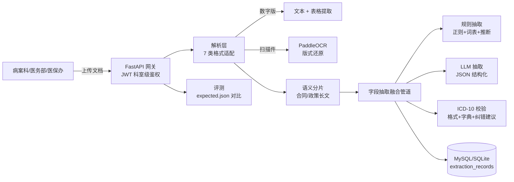

# 医疗文档智能处理中台 —— 设计文档

## 1. 系统架构

## 2. 核心设计决策

### 2.1 7 类格式适配：解析器注册表模式
- `BaseParser` 定义统一输出 `ParsedDocument(text, tables, scanned, layout)`；
- 按扩展名注册，新增格式只加一个类（`@register`），不影响上层；
- **数字版 PDF** 用 PyMuPDF 文本+表格；文本密度过低自动判定扫描件转 OCR。

### 2.2 OCR 版式还原
- PaddleOCR 输出带坐标的文本行 → 按行 y 聚类 → 行内按 x 排序 → 还原「字段: 值」表单；
- 这是病案首页（表单类文档）抽取的关键前处理：把图片变回结构化键值文本。

### 2.3 抽取：LLM 优先 + 规则补位的融合管道
- 规则层：正则 + 科室词表 + 入出院日期推算住院天数（离线可用、可解释、可审计）；
- LLM 层：15 字段 JSON 结构化抽取（在线）；
- 融合：LLM 值非空优先，规则补空缺，逐字段输出 confidence 与 source —— 评审可回溯；
- 无 LLM Key 时全链路用规则层，保证"零配置可跑"。

### 2.4 ICD-10 校验闭环
- 格式校验（字母+2位数字+可选小数）→ 字典命中 → 未命中给出前缀近邻纠错建议；
- 配套 `icd_sample.json`（36 条高频编码），生产接权威 ICD 字典库。

### 2.5 科室级权限隔离
- JWT 携带 department/role 声明；抽取接口仅限病案科/医务部/医保办；
- 记录查询可见性：医务部全量，其他科室仅本科（`can_view` 统一规则）。

### 2.6 评测体系
- `data/gen_samples.py` 生成 12 份样例 × 6 载体 + `expected.json` 标注；
- `app/eval/run_eval.py` 逐字段比对：字段准确率/综合准确率/ICD 匹配率；
- 每份样例同时是接口测试与演示的固定输入。

## 3. 接口一览
| 方法 | 路径 | 权限 | 说明 |
|---|---|---|---|
| POST | /api/auth/login | 公开 | 登录获取 JWT |
| POST | /api/documents/parse | 任意登录 | 多格式解析 + 分片统计 |
| POST | /api/documents/extract | 病案科/医务部/医保办 | 文本 → 15 字段 + ICD 校验 |
| POST | /api/documents/process | 同上 | 上传 → 解析+抽取+落库 |
| GET | /api/records | 登录 | 记录查询（科室级可见性） |
| GET | /healthz | 公开 | 组件状态 |

## 4. 面试话术要点
- **"多格式文档解析"**：注册表模式 + 统一 ParsedDocument 抽象，7 类格式 7 个类，各自单测；
- **"OCR 版式还原与表格识别"**：坐标聚类还原键值行，数字版 PDF 直接走 PyMuPDF 表格，
  扫描版走 OCR，两条路都归一化到同一结构，上层无感知；
- **"15 类字段抽取 + ICD 校验"**：双引擎融合（LLM 优先、规则补位、置信度可审计），
  ICD 校验三件套（格式/字典/纠错建议）形成质控闭环；
- **"科室级权限隔离"**：JWT 声明 + 依赖注入（require_departments）+ 记录级 can_view 双层控制；
- **"准确率 93%"**：评测集 12 份 × 15 字段，逐字段可查 eval_detail.json，指标可复现。
